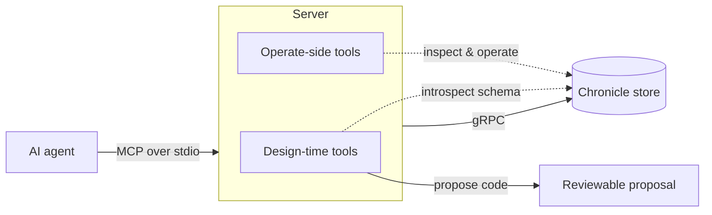

# How it works

The Chronicle MCP server exposes two kinds of capability over one connection. Understanding the split is the fastest way to know which tool an agent will reach for — and why the design-time tools can be trusted not to make things up.

## Two modes

**Operate-side** is about *inspecting and operating a live system*. These tools read events, list observers, report failed partitions, and manage jobs. They are the natural-language equivalent of running the [Cratis CLI](https://github.com/Cratis/cli) against a store. See [Operating a store](operate-side/index.md).

**Design-time** is about *turning intent into Chronicle artifacts*. Given a plain request, these tools introspect the store's registered schema and produce read models, projections, audits, and catalogs. They are deliberately generative and advisory rather than operational. See [Design-time capabilities](design-time/index.md).

The two are complementary: an agent might use operate-side tools to discover what event types exist, then a design-time tool to scaffold a read model from them.

## Grounding over fluency

Every design-time capability rests on one principle: **introspect the store before generating anything.** Field names, types, and event names come from Chronicle's schema — never from a guess.

- Event fields are read from the JSON schema registered with each event type, exposed through [describe an event type](design-time/describe-event-type.md).
- Consumers (projections, reducers, reactors) are read from the store's projection and observer definitions.
- When the store does not have enough information to answer confidently — for example a requested event type is not registered — the tool says so and returns no fabricated shape, rather than inventing one.

This is worth over-engineering relative to the natural-language parsing itself: a plausible-sounding but wrong field name is worse than a tool that asks a clarifying question.

## Read-only against the store, generative against your codebase

No design-time capability mutates the store. They need only read access to the event type registry, projection and observer definitions, and namespaces. Generated code is returned as a proposal — the agent shows it to you, and you review it like any other change and apply it to your own project. Projections are cheap to regenerate but should never appear unreviewed in a codebase.

## Multi-tenancy awareness

Chronicle isolates tenants by namespace. Every tool is scoped to an event store and namespace — defaulting to your configured defaults, overridable per call — so one tenant's event shapes never leak into another's suggestions by accident.
